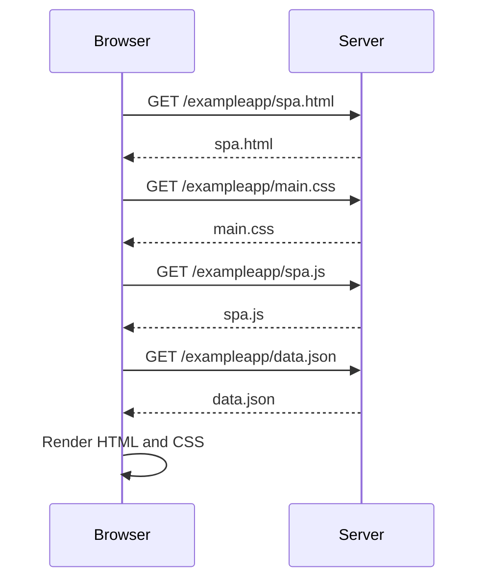

# 0.5: Single page app diagram

The diagram depicts only what takes place when the browser request the server to send spa.html and the other files to be displayed and executed in the brower. In the file exercise_6 you will find the diagram that depicts what happen when the form is created.

