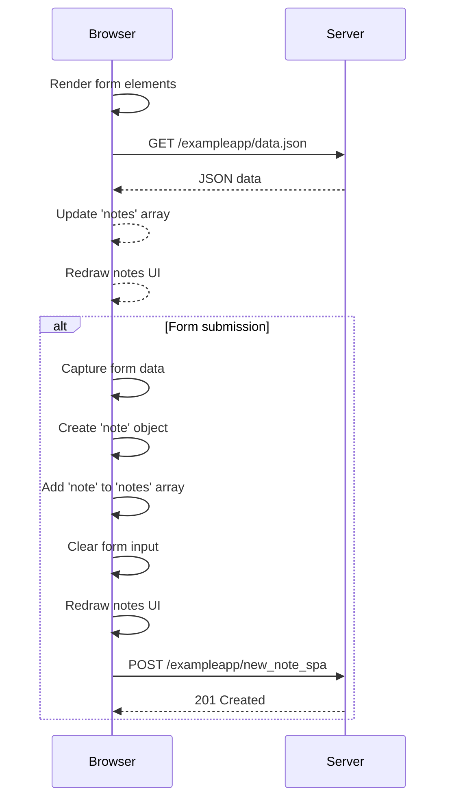
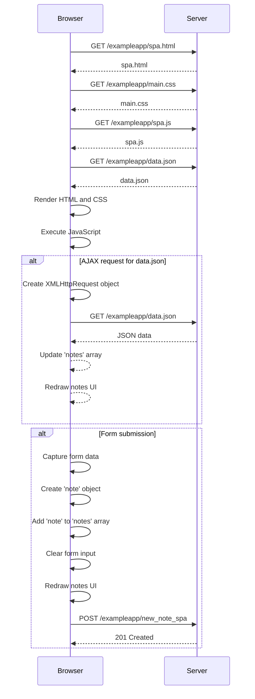

# 0.6 New note in Single page app diagram

# Diagram that depicts the full scenario from the moment the browser sends the first request to the server until form is used in the browser side and data is send to the server.

